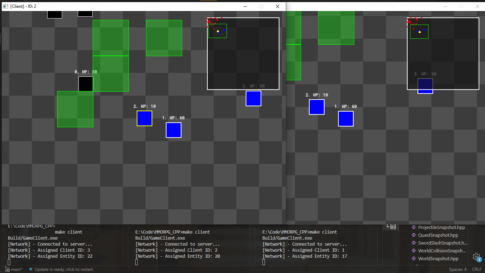
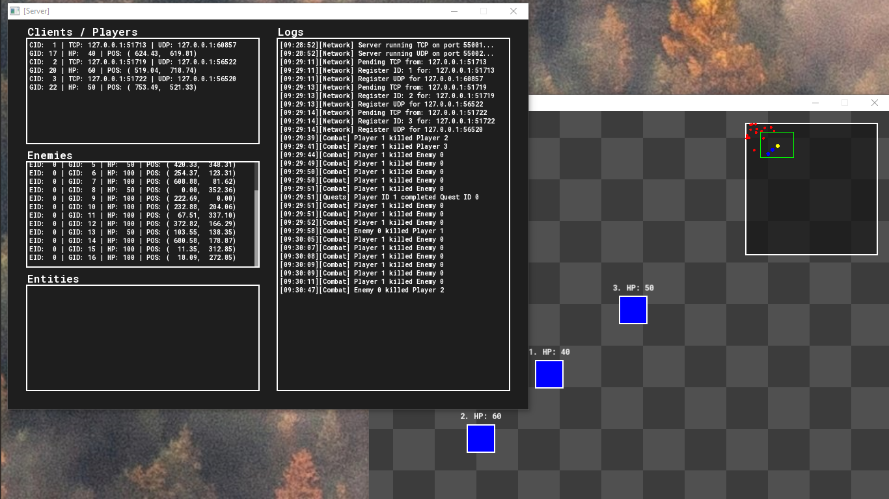

# C++ Client–Server Multiplayer Game Engine


A robust prototype of a real-time multiplayer game engine built from scratch using C++ and SFML. This project demonstrates core concepts of network programming, server-authoritative architecture, state synchronization, and custom game physics.

Unlike typical game projects that rely on Unity or Unreal, this project implements the low-level systems manually to understand the "how" and "why" behind multiplayer game architecture.

---
## Game Screen





## Key Features

### Networking & Architecture
- **Server-Authoritative Model:** The server owns the game state; clients send inputs and render the state.
- **Hybrid Protocol:** Custom packet handling using SFML Network (TCP/UDP).
- **Ping & Latency Tracking:** Real-time monitoring via `TcpPingTracker` and `UdpPingTracker`.
- **Snapshot Synchronization:** Server broadcasts world snapshots (Players, Enemies, Projectiles) at a fixed tick rate.
- **Interest Management:** Bandwidth optimization via a `ChunkSystem` (only syncs what is near the player).
- **Event-Driven System:** Discrete event handling (`EquipItem`, `MoveItem`, `NewClient`) via a central `EventBus`.

### 🎮 Client-Side Simulation
- **State Management:** Robust State Pattern for `LoginState` and `InGameState`.
- **Client-Side Prediction:** Immediate local movement response with server-side reconciliation.
- **Entity Interpolation:** Smooth rendering of remote entities between snapshot updates.
- **Inventory UI:** Full UI system with Drag & Drop support and equipment management.

### Gameplay & Systems
- **Combat System:** Melee (Sword Slashes) and Projectiles with server-side hitbox detection.
- **AI System:** Basic enemy behaviors managed by `EnemyAISystem`.
- **Data Persistence:** Player stats and inventories saved in JSON format.
- **Physics:** Custom AABB collision detection and resolution.

---

## Project Structure

```text
.
├── Assets/                 # Fonts and JSON Player Data
├── Build/                  # Compiled executables and objects
├── Sources/
│   ├── Client/             # Client-side Logic
│   │   ├── Core/           # Main loop (Client.cpp)
│   │   ├── Entities/       # Remote entity representations
│   │   ├── Network/        # Socket handling & Login logic
│   │   ├── PingTracker/    # TCP/UDP Ping monitoring
│   │   ├── Prediction/     # Interpolation & Prediction algorithms
│   │   ├── Snapshots/      # Snapshot data structures
│   │   ├── States/         # FSM (Login, InGame)
│   │   ├── UI/             # Inventory & Debug UI
│   │   └── World/          # Client-side collision & world
│   │
│   ├── Server/             # Server-side Logic
│   │   ├── Core/           # GameWorld & Sync Systems
│   │   │   └── Chunk/      # Spatial partitioning (ChunkSystem)
│   │   ├── Entities/       # Authoritative Entity logic (AI, Player)
│   │   ├── Events/         # EventBus & Network Events
│   │   ├── Network/        # Packet broadcasting & Session management
│   │   ├── Systems/        # ECS-style logic
│   │   │   ├── AI/         # Enemy behavior
│   │   │   ├── Combat/     # Damage & Weapon systems
│   │   │   ├── Input/      # Client request processing
│   │   │   ├── Interest/   # Network culling (InterestSystem)
│   │   │   ├── Inventory/  # Item logic & Persistence
│   │   │   └── Physics/    # Collision & Movement
│   │   └── Utils/          # ThreadSafeQueue, Random, Fonts
│   │
│   └── Shared/             # Common Utils, AABB, Constants, InputState
└── Makefile                # Build configuration
```

---

## Build & Installation

### Prerequisites
- **Compiler:** g++ (MinGW-w64) supporting C++17.
- **Library:** SFML 2.5+.
- **Make:** GNU Make.

### Compilation
The project uses a Makefile to handle separate builds for Client and Server.

```bash
# Build both Client and Server
make all (make client && make server)

# Clean build artifacts
make clean
```

### Running the Game
1. **Start the Server**:
   ```bash
   ./Build/GameServer.exe
   ```
2. **Start the Client**:
   ```bash
   ./Build/GameClient.exe
   ```

---

## Engineering Challenges

1.  **Latency Compensation:** Implemented Client-side Prediction and Reconciliation to ensure movement feels "snappy" despite network lag.
2.  **Scalability:** Developed a `ChunkSystem` and `InterestSystem` to limit the data sent to each client, allowing for larger worlds and more players.
3.  **Concurrency:** Utilized a `ThreadSafeQueue` for processing network packets asynchronously from the main game loop.
4.  **Data Integrity:** All gameplay-critical logic (Combat, Inventory, Physics) is performed on the Server to prevent client-side hacking.

---

## Roadmap
- [ ] **Database:** Migrate from JSON to SQLite for player data.
- [ ] **Security:** Add basic packet encryption and authentication.
- [ ] **Assets:** Integration of Sprite animations and Tilemaps.

---

## License
This project is for educational purposes. Feel free to use the code to learn about multiplayer game architecture.
